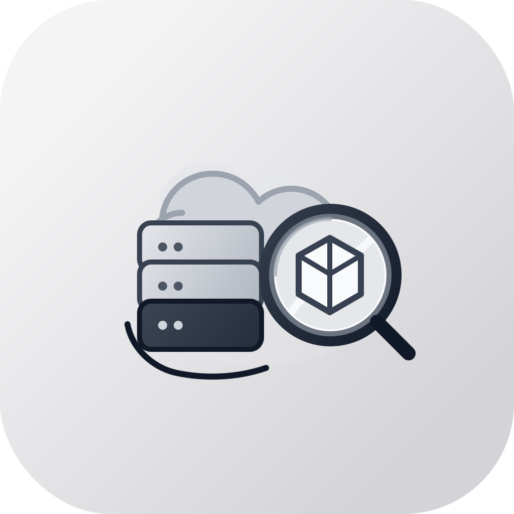
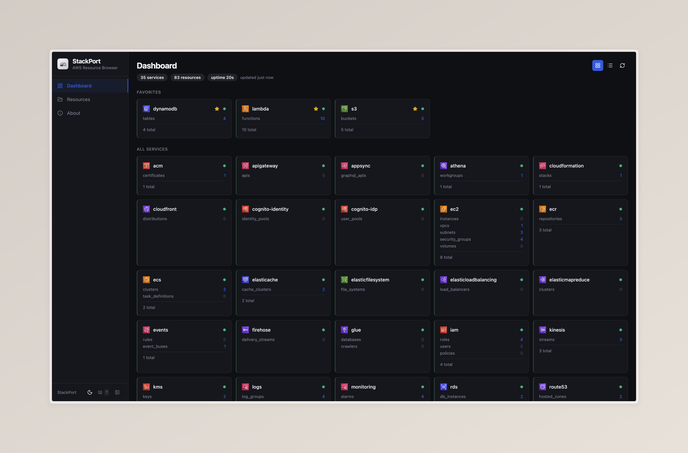
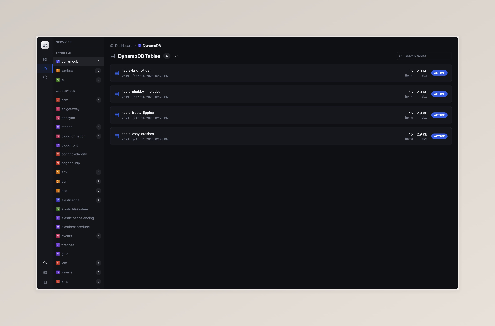
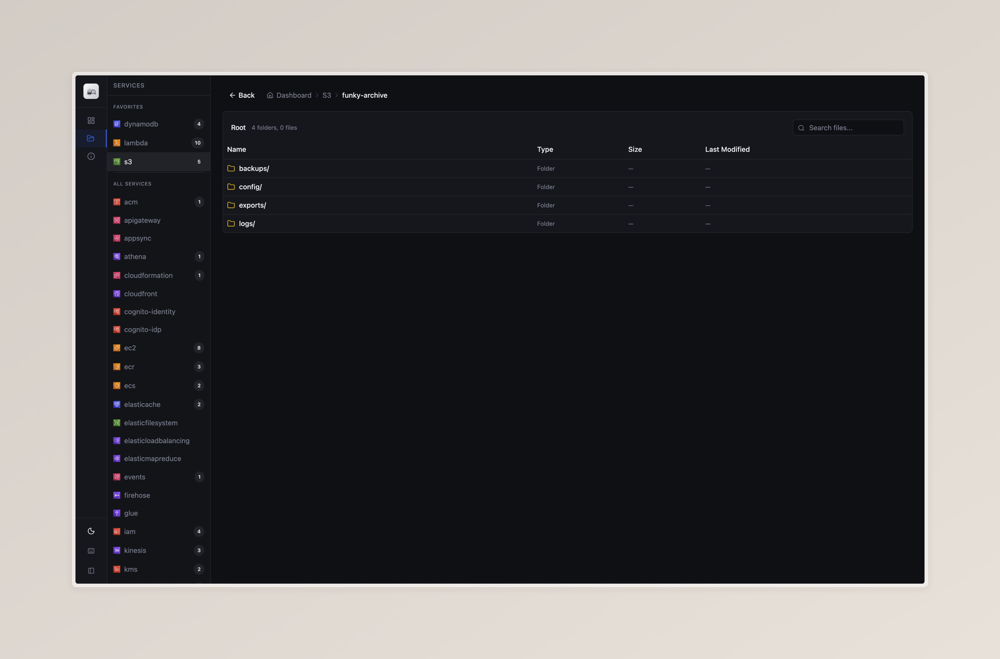

<p align="center">
  
</p>

<h1 align="center">StackPort</h1>
<p align="center"><strong>Universal AWS resource browser for local emulators. Built to work with MiniStack, and also compatible with LocalStack, Moto, or any AWS-compatible endpoint.</strong></p>

<p align="center">
  <a href="https://github.com/DaviReisVieira/stackport/actions/workflows/ci.yml"></a>
  <a href="https://pypi.org/project/stackport/"></a>
  <a href="https://hub.docker.com/r/davireis/stackport"></a>
  <a href="https://hub.docker.com/r/davireis/stackport"></a>
  <a href="https://github.com/DaviReisVieira/stackport/blob/master/LICENSE"></a>
  
  <a href="https://github.com/DaviReisVieira/stackport/stargazers"></a>
</p>

## Screenshots

**Dashboard** — Service overview with resource counts and health status


**DynamoDB Browser** — Generic resource table with search, pagination, and detail view


**S3 Browser** — File browser with folder navigation and object preview


## Features

- Browse and inspect resources across **35 AWS services**
- S3 file browser with folder navigation, search, pagination, and download
- Dashboard with service health, resource counts, and auto-refresh
- Single Docker image, zero AWS dependencies
- Works out of the box with MiniStack's default port (4566)

## Quick Start

### With MiniStack (recommended)

```bash
# Start MiniStack
pip install ministack && ministack

# Start StackPort
pip install stackport
stackport
# Open http://localhost:8080
```

### Docker Compose (MiniStack + StackPort)

This example uses [MiniStack](https://github.com/Nahuel990/ministack) as the emulator, but you can swap it for LocalStack, Moto, or any AWS-compatible endpoint — just update `AWS_ENDPOINT_URL`.

```bash
curl -O https://raw.githubusercontent.com/DaviReisVieira/stackport/main/examples/docker-compose.yml
docker compose up -d
# Open http://localhost:8080
```

### Docker (standalone)

```bash
docker run -p 8080:8080 -e AWS_ENDPOINT_URL=http://host.docker.internal:4566 davireis/stackport
```

### Other emulators

StackPort works with any AWS-compatible endpoint — just set `AWS_ENDPOINT_URL`:

```bash
# LocalStack
AWS_ENDPOINT_URL=http://localhost:4566 stackport

# Moto
AWS_ENDPOINT_URL=http://localhost:5000 stackport

# Any custom endpoint
AWS_ENDPOINT_URL=http://my-emulator:4566 stackport
```

## Configuration

| Variable | Default | Description |
|---|---|---|
| `AWS_ENDPOINT_URL` | `http://localhost:4566` | Target AWS endpoint (MiniStack default) |
| `AWS_REGION` | `us-east-1` | AWS region |
| `AWS_ACCESS_KEY_ID` | `test` | AWS access key |
| `AWS_SECRET_ACCESS_KEY` | `test` | AWS secret key |
| `STACKPORT_PORT` | `8080` | StackPort server port |
| `STACKPORT_SERVICES` | *(35 services)* | Comma-separated services to probe |

## Supported Services (35)

ACM, API Gateway, AppSync, Athena, CloudFormation, CloudFront, Cognito (IDP + Identity), DynamoDB, EC2, ECR, ECS, ElastiCache, EFS, ELB, EMR, EventBridge, Firehose, Glue, IAM, Kinesis, KMS, Lambda, CloudWatch Logs, CloudWatch Monitoring, RDS, Route 53, S3, Secrets Manager, SES, SNS, SQS, SSM, Step Functions, WAFv2

S3 has a dedicated file browser. All other services use the generic resource table with detail view.

## Development

```bash
git clone https://github.com/DaviReisVieira/stackport.git
cd stackport
pip install -e .
cd ui && npm install && npm run dev
```

See [CONTRIBUTING.md](CONTRIBUTING.md) for full details.

## License

MIT
